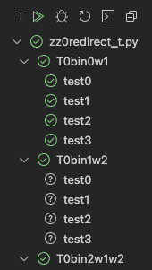

# Concern

## 2022-01-04a

Under certain conditions, you can see the following strange report from vscode unittest

The conditions are:
- on my 4-core Mac
- if you want to "debug all tests"

I suspect this phenomenon is due to vscode, not my program.
